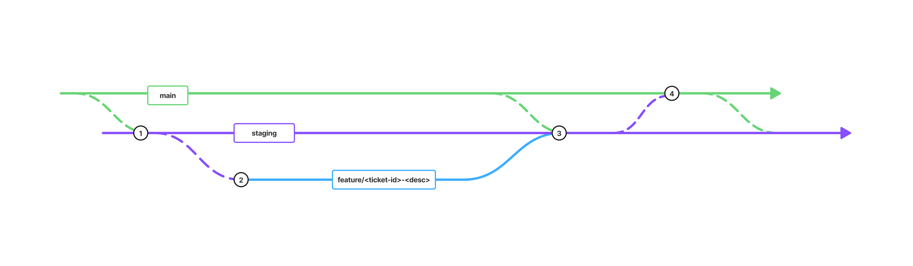

# PR and Branching Process

## Purpose

This document defines the standard branching and pull request workflow for the CakeBox replatform workstream.

The goal is to keep delivery consistent, review cycles predictable, and QA handovers clear.

## Main Branch Policy

- `main` is the production reference branch and must remain stable.
- No active feature development is carried out directly on `main`.
- Direct pushes to `main` are not permitted; all changes must use pull requests.
- To keep environments aligned, sync PRs are taken from `main` into `staging` after releases or urgent production hotfixes.

## Branch Naming Standard

- Create all feature work from `staging`.
- Use branch format: `feature/<ticket-id>-<short-description>`
- Keep names lowercase and hyphenated.

**Example:** `feature/CB-142-add-checkout-validation`

## Branching Workflow Diagram

### Legend

- **1:** Create feature branch from `staging`.
- **2:** Complete development on `feature/<ticket-id>-<desc>` and run local checks.
- **3:** Raise and merge **PR Type 1** from feature branch into `staging` after review.
- **4:** Raise and merge **PR Type 2** from `staging` into `main` after QA sign-off.

## PR Workflow

### PR Types

- **PR Type 1 (Feature PR):** `feature/<ticket-id>-<desc>` -> `staging`
- **PR Type 2 (Release PR):** `staging` -> `main`

### Review Model

- **Feature PR review:** normal code review by reviewers.
- **QA validation:** completed on `staging` after Feature PR merge.
- **Release PR review:** release review and merge by release owner.

| Step | Action | Owner | Expected Timeframe |
| :--- | :--- | :--- | :--- |
| 1 | Developer creates feature branch from `staging`, using correct naming format (`feature/<ticket-id>-<desc>`). | Developer | Before coding starts |
| 2 | Developer completes work and runs local checks: lint, build, and basic smoke test. | Developer | Before PR raised |
| 3 | Developer raises **PR Type 1 (Feature PR)** to `staging` with: JIRA ticket link, change description, screenshots or short Loom (for UI changes), and reviewer test steps. | Developer | On completion |
| 4 | PR assigned to developer reviewer. | Cake Box | Within 2 hours of PR raised |
| 5 | Reviewer validates code against PR checklist (Section 2.4), then approves or requests changes with clear comments. | Reviewer | Within 1 business day |
| 5i | Developer addresses all requested changes and re-requests review. | Developer | Within 1 business day |
| 6 | Reviewer approves and developer merges Feature PR to `staging`. | Developer | Post-approval |
| 7 | QA validates changes on `staging`, logs defects if found, and provides sign-off or marks as failed with issues for rework. | QA | Within 1 business day of merge |
| 8 | After QA sign-off, release owner raises **PR Type 2 (Release PR)** from `staging` to `main`, then completes release review and merge. | Release Owner | As scheduled release window |

## PR Submission Checklist

Before requesting review, ensure:

- PR links to the correct JIRA ticket.
- Description clearly explains what changed and why.
- Screenshots or a short Loom are included for UI changes.
- Test steps are included so reviewers can validate quickly.
- Local lint/build/smoke checks have passed.

---

**Contributors:** Helen Goatly & Moses Sangobiyi  
**Date:** April 2026
